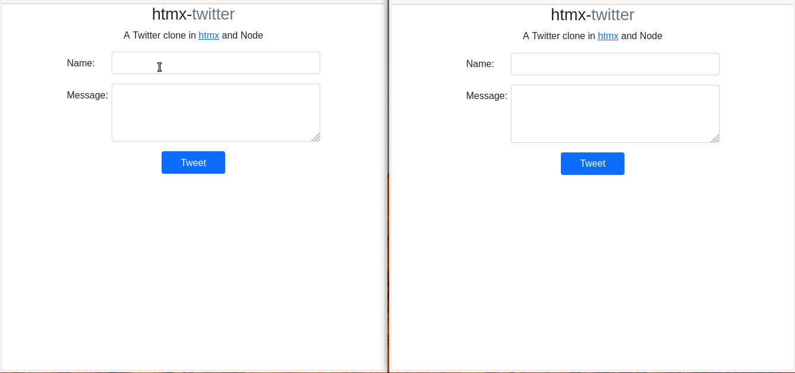

# htmx-twitter-clone
A Twitter clone in [htmx](https://htmx.org) and Node

You can view the live demo [here](https://htmx-twitter.herokuapp.com)

## Usage
Clone this repo, install dependencies and start the server.
```
git clone https://github.com/rajasegar/htmx-twitter-clone
cd htmx-twitter-clone
npm install
npm start
```

You can view the application in `localhost:3000`



